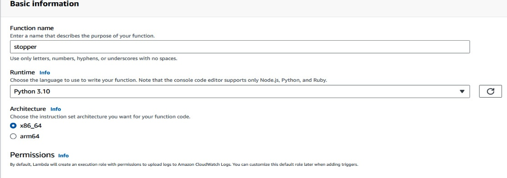
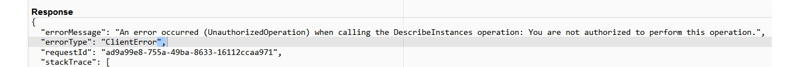
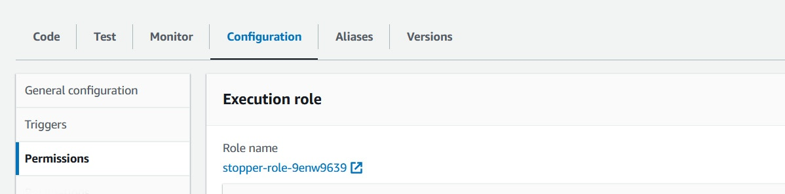
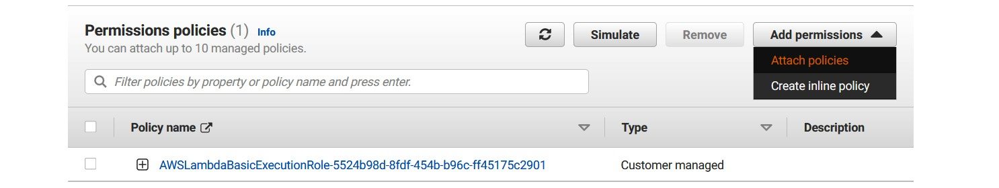
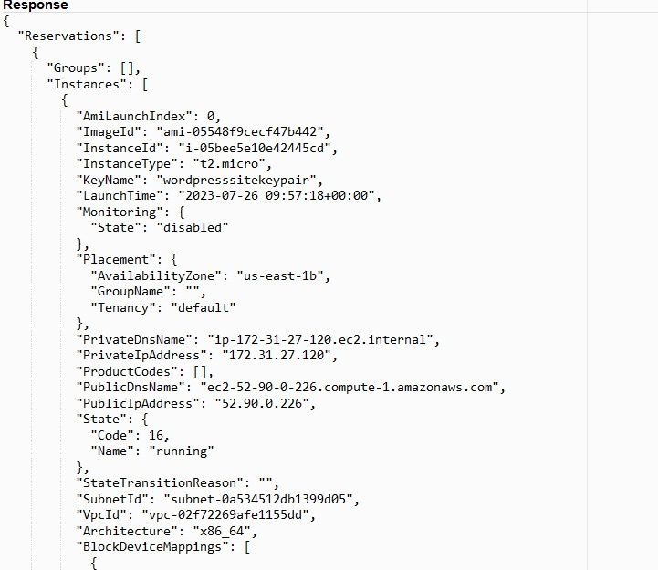
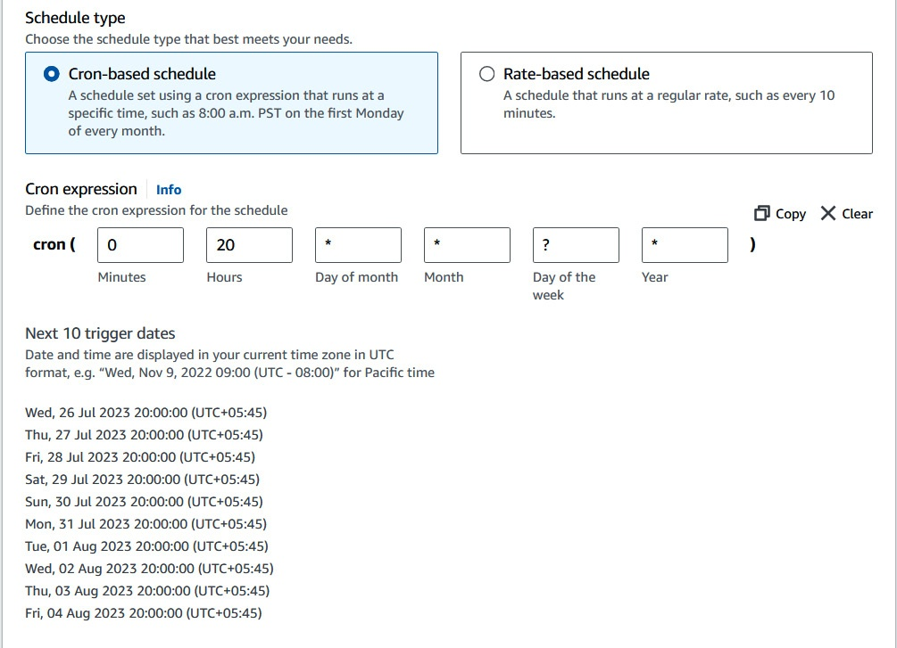
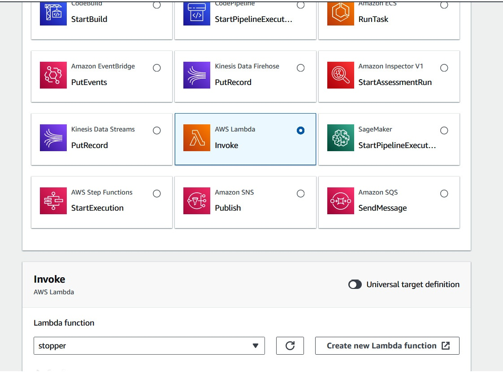

# Chapter 2 Talking about Python
## Python 101
* The Zen of Python: Tim Peters, 1999, The Zen of Python, https://peps.python.org/pep-0020/#the-zen-of-python
## What Python offers DevOps
### Automated shutdown of a server
#### AWS Lambda
Here are the steps to create a Lambda function and use it to start and stop an EC2 instance:
1. Let’s create a function called stopper with the latest available Python runtime(3.10 for this book):    
   
2.  Next, you will either have to create an execution role for the Lambda function or give it an existing one. This will be important later. But for now, do the one you prefer. Click **Create function** to create your new blank canvas.
    The reason we are using the AWS environment for the microservices to manipulate EC2 instances (other than the obvious reasons) is that the runtime that they provide comes with the **boto3** library by default, which is very useful for resource interaction.

3. Before we can start or stop any instance, we need to list them out. You have to load and dump the return function once to handle the **datetime** data type. For now, let’s just initialize the **boto3** client for EC2 and try and [list all of the instances](./ec2-start-stp.py) that are currently available:
   ```python
   import boto3
   import json
      
   def lambda_handler(event, context):
       """InitializeEC2 Client"""
       ec2_client = boto3.client('ec2')
       """Return JSON"""
       return (json.loads(json.dumps(ec2_client.describe_instances(),default=str))) 
   ```
   Running this with a test will get you an exception thrown similar to this:   
   
   That is because the Lambda function also has an **identity and access management (IAM)** role, and that role does not have the required permissions to describe the instances. So, let’s set the permissions that we may need.

4. As shown in the following figure, under **Configuration | Permissions**, you will find the role assigned to the Lambda function:    
      

5. On the page for the role, go to Add permissions and then Attach policies:   
       
   Let’s give the Lambda function full access to the EC2 services since we will need it to stop the instance as well. If you prefer or if you feel that’s too much access, you can make a custom role:    
       

6. Let’s run this again and see the results:    
       
   You’ll see the display of instances as well as information regarding whether they are running or not.

7. Now, let’s get to the part where we shut down the running instances. Add code to filter among the instances for ones that are running and get a list of their IDs, which we will use to reference the instances we want to stop:   
   ```python
   import boto3
   import json
      
   def lambda_handler(event, context):
       """InitializeEC2 Client"""
       ec2_client = boto3.client('ec2')
       """Return JSON"""
       instances_json = json.loads(json.dumps(ec2_client.describe_instances (Filters = [
         {
            'Name': 'instance-state-name',
            'Values': [
                       'running'
                      ]
         }
       ]),
       default=str))

       """Filter to only instance_ids"""
       instance_ids = [instance ["Instances"][0]["InstanceId"] for instance in instances_json["Reservations"]]
       """Shut down selected instance_ids"""
       response = ec2_client.stop_instances(
         InstanceIds=instance_ids
       )
       return response
   ```
   Simple enough to understand, especially if we are following the principle of readability and explicitness.

   The instances are now in a state where they are shutting down. And soon, they will be stopped:     
      

8. Now that we have done it once, let’s automate it further by using a service called EventBridge, which can trigger that function every day. Navigate to **Amazon EventBridge** and make an EventBridge schedule:   
   
9. Select our Lambda function as the event target:    
   
   
You can now create the EventBridge scheduled event, which will trigger at 8 P.M. every day and list and shut down your EC2 instances.

So, in following these steps, you now have the tools necessary to schedule the shutdown of instances based on the timed schedule that you want.  

### Autopull a list of Docker images
Grabbing Docker images can be tedious. Especially grabbing multiple images. So now, we are going to see how we can pull a number of Docker images at the same time using the Python library for Docker:

> ### Don’t Forget to Use a Virtual Environment  or AnaConda 
>>  **💡 Tip:** The virtual environment you’ve been using in the previous part
>  of the book can be used for the discussion in this chapter, or you can
>  create a new one. Here’s a refresher on how to do that:
>  ```bash
>  $ cd /path/to/code/Chapter2
>  $ python -m venv .venv
>  $ source venv/bin/activate
>  (venv) $ pip install -U pip
>  (venv) $ pip install docker 
>  ```
>  If in conda:
>  ```bash
>  $ cd /path/to/code/Chapter2
>  $ conda create -n devops python=3.10
>  $ conda activate devops
>  (devops) $ pip install docker 
>  ```

1. First, install the Docker Python library in a virtual environment using the following command:
   ```bash
   pip install docker
   ```
2. Then, write a script in a file called [**docker_pull.py**](./docker_pull.py) to loop through a list of image names and pull them by leveraging the Docker library.

3. After this, run the file using this command:
   ```bash
   python docker_pull.py
   ```
   You can then run the **docker images** command to check out the Docker containers that you may have locally:
   ```bash
   $ docker images
   
   REPOSITORY   TAG       IMAGE ID       CREATED        SIZE
   redis        latest    170a1e90f843   2 months ago   142MB
   nginx        latest    92b11f67642b   6 weeks ago    191MB
   ```
# Summary
Python is not just about writing code; it is about a coding philosophy – a philosophy that has made Python incredibly popular among DevOps engineers. The writing of the Zen of Python affected the way that the language was developed, and we still see the consequences today in both Python and DevOps. Python’s philosophy offers the DevOps realm the programming language that fits its philosophy.

Python has numerous uses that facilitate a lot of DevOps tasks. So, hopefully, this chapter has given you some insights into what makes Python such a good companion for DevOps. In the next chapter, you will see that companionship in action and learn how to use your knowledge in a truly hands-on way.