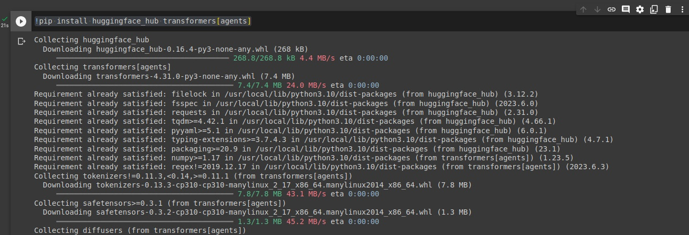
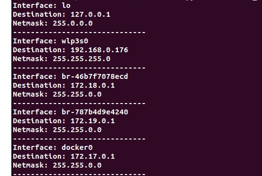

# Chapter 3  The Simplest Ways to Start Using DevOps in Python Immediately
Over the past couple of chapters, you’ve probably been thinking, all these principles and philosophies are fine, but I want to get my hands dirty! If that’s what you want, then this is the chapter for you. In this chapter, you will learn how to use Python and its libraries to serve the purposes of your workloads.

Now, I’m not suggesting that you switch to Python-based alternatives from what you are currently using. In fact, most of the tools and techniques that we are about to discuss are meant to be in support of existing infrastructure and methods as opposed to a replacement for them.

This chapter is meant to give you a good grasp of the possibilities that the Python programming language provides DevOps as well as the ways that you can integrate it into your pre-existing systems and infrastructure.

In this chapter, we are going to learn about a few simple implementations of Python in different aspects of API calls:

* Making API calls and the different ways that API calls are made
* How Python can help analyze, construct, and optimize your workload’s networking resources
## Technical requirements
There are a few technical requirements that may need to be fulfilled if you want to get the most out of this chapter:
* A GitHub account
* A Replit account (which has a single sign-on with GitHub)
* A Hugging Face account
* A Google account
* Any computing device with an internet connection and a command line interface
* The ability to tolerate my writing style

Well, if you can get those in hand, then you are ready to start your journey in this chapter. Let’s get going.
## Introducing API calls
To define API calls, let’s start with what an **Application Programming Interface (API)** is. An API is a software interface that offers your application access to functions and processes from other applications. Think of it like this: when a user tries to get information from an application, they do so through the **user interface (UI)**. The API has a similar function for software, so you could call API the UI of software.

Now, API calls are made for a number of reasons:
* You don’t want to write the underlying logic for a big feature yourself (trust me, a lot of the time, you don’t.
* The API gives access to resources that you ordinarily would not have (i.e., creating a Virtual Machine using the API of a cloud provider)
* You just want to get some information into your application (public APIs are very good for this)

Any coding library that you use for code is technically an API. You pull the library in and you call it to perform a function for your application. So, you can see why the definition of APIs can be confusing sometimes. But the point is this: more things are APIs than are not APIs. Everything you see in an app or a website comes from APIs.

So, let’s dive into a couple of examples of how to use APIs to our benefit in DevOps.

### Exercise 1 – calling a Hugging Face Transformer API
I chose this exercise because it is **free**, it will introduce you to a lot of integral tools and concepts behind APIs, and **Hugging Face APIs** are quite popular, so you will get hands-on experience with those. The API that we will be using specifically is a transformer that turns a written prompt into an image. It’s a great API to learn and find out how APIs in general work. For this lesson, I am using a Google Colab notebook, which is a Jupyter Notebook hosted by Google. It’s pretty useful when you want to recreate runtimes for certain sections of code. It’s like having your own little test section that you can divide into even smaller sections if you want to. Let’s make a notebook to further explore our Hugging Face API:
1. To open a Colab notebook, you can go to https://colab.research.google.com and create a new notebook. The end result should be something like this:
   
2. The first thing we need to do is install the correct libraries. These libraries contain the functions and modules with which we call our APIs. You can install them directly in the notebook if you’d like. We are going to install the huggingface_hub and transformers[agents] libraries. Here is the command for this:
   ```bash
    !pip install huggingface_hub transformers[agents]
   ```
   When you put this command in the cell and press play, it will install the libraries in your runtime:    
   
3. The next thing that you need to do is log in to **huggingface_hub** using an API key.    
   This is where the concept of the API key comes from. An API key is like a login but for your software. Most companies only allow full access to their APIs through the purchase of an API key. A lot of open source projects such as Hugging Face have API keys to promote and track user interaction and sometimes upgrade their users to a premium version if they want.
4. To get a Hugging Face API key, you must first go to the [huggingface.co](https://huggingface.co/) web page and sign up or log in if you’ve already signed up. After doing that, go to your profile and then to the **Settings** tab and into the **Access Tokens** tab from there. You can generate an access token for use there:
   
5. You can copy this token for use in your next section of code. Here, you import the Hugging Face login module for the login API, and you input your key to use the API:
   ```python
   from huggingface_hub import login
   login("<your_key_here>")
   ```
   You’ll get this message if you’ve loaded it correctly. If so, congratulations, you successfully called the login API:    
   

   Now comes the fun part. We are going to use the Hugging Face Transformer API to take a line of text and turn it into an image. But first, we must import a Hugging Face agent using the **HfAgent** API (see the pattern?):
   ```python
   from transformers import HfAgentagent = HfAgent("https://api-inference.huggingface.co/models/ bigcode/starcoderbase")
   ```
   We are using the **starcoderbase** model for this. Once you run this and get the agent, you can simply type in a prompt to generate an image:
   ```python
   agent.run("Draw me a picture of `prompt`", prompt="rainbow butterflies")
   ```
   But remember, if you don’t want to wait half an hour for your image, use the GPU runtime by going to the **runtime** tab and selecting it:    
   
6. The end product will leave you shocked and satisfied. You’ll get something like this:    
   

So, we have completed this exercise and successfully called an API that has given us a visibly satisfying conclusion. What more could one ask for? Now, if only other people could witness the fruits of your labor!

Well, that’s what calling APIs is all about. APIs are meant to be consumed by your target audience and so now, we are going to see how we can distribute our APIs.

See  https://colab.research.google.com/github/robert0714/Packt-Hands-On-Python-for-DevOps-2024/blob/main/Chapter3/HuggingFaceTest.ipynb
### Exercise 2 – creating and releasing an API for consumption
Deploying applications is one of the most frequent tasks that a DevOps engineer might encounter. It is important to have a good, fast deployment, but before that, it is important to have a deployment in the first place. Deploying smaller and larger applications are alike in a lot of ways. One major way in which they differ is the lengths you must go through to maintain availability on larger applications. We won’t be discussing that in this section. We will instead just try to get an API up for adding two numbers. Like I said, let’s keep it simple and begin creating a new **Replit Repl** and start coding in it.

1. Sign up for an account at [replit.com](https://replit.com/). You can create small virtual environments for practically every application framework and code base there. Once you have signed up, you can create a **Repl**, which is a small virtual server, by clicking the **Create Repl** button:   
      
2. Once you have done that, search for and create a Repl with the Flask template. The name is not relevant:   
   
   This will give you an IDE that contains boilerplate Flask code that is pre-initialized and installed with the basic Flask libraries:
        
3. Concerning the preceding figure, when you click the **Run** button shown on top, you’ll launch a Flask server, a URL that will return some sort of answer when it is called. The server’s default route of "/" has already been defined. So, if you open the URL in a new tab, you’ll get something like this:   
   
   This function just returns a string on a webpage. Typically, APIs are written in a JSON format. So, let’s turn this into JSON. In Flask, that is pretty easy. You can just pass a variable that is a dictionary in the return type:   
   
   Once that’s done, you’ll get a return value in JSON:
   
4. This API, as it is, only returns static values. To have it take user input, simply add **request** parameters in the URL itself. Let’s modify our application to take two parameters, **num1** and **num2**, which will be added, and their sums shown in the JSON return value:   
      
   The end result requires a URL in the form of `<your_url_here>/?num1=<number>&num2=<number>`. The result would look something like this:   
   
   So, now you have learned how to make an API in Python that adds two numbers and deploys the API. That’s a really big step. The only thing that gets exponentially more complex in the programming world is business logic. Security and networking are important too, but they usually follow a set formula. As long as you can deploy your logic to your end user, you’re good.

Now, that you have learned the art of the API, we are going to dive into what delivers APIs to their end users. We are diving into networking. Networking is such an integral part of DevOps and application development in general that sometimes it’s not mentioned at all. So, let’s look at a few useful ways that we can use Python on the networking side.

## Networking
No, this is not about growing your LinkedIn connections, although that’s something I’d recommend doing too. Computer networks are essential to the functioning of every application these days because they are the only way to deliver constant value to the user while keeping them connected to your environment. Almost every device these days is connected to a network, which is why understanding the network of devices and the network of networks (it’s something called the internet, ever heard of it?) is very important.

I am now going to demonstrate two examples of how to use Python for networking insights and data collection.

### Exercise 1 – using Scapy to sniff packets and visualize packet size over time
**Scapy** is a Python library that can be used to replicate, simulate, and manipulate the data packets that are sent over a computer network. Scapy is a very useful tool in the belt of any developer or DevOps professional.

In this exercise, we are going to use Scapy to collect a list of packets and get their timestamps and packet sizes. We are then going to map these onto a chart that we make using the **matplotlib library**. You can use the previously mentioned Google Colab for this exercise. So, let’s initialize the notebook and start writing our code:
1. First, we need to install the matplotlib and scapy libraries:
   ```bash
   !pip install scapy matplotlib
   ```

2. Now, let’s write the code to use Scapy’s sniff module to get a list of packet sizes over timestamps:
   ```python
   from scapy.all import sniff
   # Lists to store packet sizes and timestamps
   packet_sizes = []
   timestamps = []
   #Handle packets and get the necessary data
   def packet_handler(packet):
   print(packet)
   packet_sizes.append(len(packet))
   timestamps.append(packet.time)
   # Start packet sniffing on the default network interface
   sniff(prn=packet_handler, count=100)
   ``` 
   You will get a list of the length of the last **100** packets that went through your network along with the timestamp and the type of traffic. If you refer to the following diagram, the packet sizes are stored in the **packet_sizes** array and the timestamps of the packet are stored in the **timestamps** variable:
   

3. Let’s now write the code to plot the packet size over time using matplotlib:
   ```python
   # Create a plot
   plt.figure(figsize=(16, 8))
   plt.plot(timestamps, packet_sizes, marker='o')
   plt.xlabel("Time")
   plt.ylabel("Packet Size")
   plt.title("Packet Size over Time")
   plt.grid(True)
   plt.show()
   ```
   This will give us a chart with time on the x-axis and packet size on the y-axis:
   

   The preceding chart shows a pattern of network activity that seems to involve several correlated packets. So, you can see the network analysis library coming in handy already.

So, we have now tracked our network activity and generated data insights from it using Python. Let’s look at one more network implementation, this time focusing on the routing rules that your device (or the device you are running your workload on) has.
### Exercise 2 – generating a routing table for your device
Routing tables define the routes that certain web traffic takes within your devices. These tables exist in practically every device, and they define the routes by which those devices access computer networks. You can use the **netifaces Python library** to generate a routing table showing all the available routes and destinations that your device contains. The netifaces library in this case is used to collect the network interfaces (hence the name netifaces) of your operating system. You will then parse this information and display it in a tabular form. You can once again use Google Colab for this, though for more interesting results, you could try running the code locally.
1. Let’s begin the steps to generate a routing table for your device. If you’ve been following along so far, you know the first step is installing the library:
   ```bash
   !pip install netifaces
   ```
   
2. Next, write code to generate the routing table:
   ```python
   #import library
   import netifaces
   #begin function
   def generate_routing_table():
   routing_table = []
   #Loop through network interfaces
   for interface in netifaces.interfaces():
        #initialize current address of interface
   Interface_addresses =netifaces.ifaddresses(interface)
   #Check for, then loop through the addresses
   if netifaces.AF_INET in addresses:
   for entry in  	interface_addresses[netifaces.AF_INET]:
   	#Create routing entry wherefound
   if 'netmask' in entry and 'addr' in 	entry:
   routing_entry = {
   'interface': interface,
   'destination': entry['addr'],
   'netmask': entry['netmask']
   }
   #Append route to routing table
   routing_table.append(routing_entry)
   return routing_table
   #Call function
   routing_table = generate_routing_table()
   #Display routing table
   for entry in routing_table:
   print(f"Interface: {entry['interface']}")
   print(f"Destination: {entry['destination']}")
   print(f"Netmask: {entry['netmask']}")
   print("-" * 30)
   ```
   It’s a lot of code, but fairly easy to make sense of. It also provides you with detailed information about where the network traffic goes from your network interfaces. If you tried it on Colab as I suggested, you’d get something like this:    
       
   And if you’ve done it on your personal computer, you might get something like this:    
      
   A bit more baggage was added there.

But that is the gist of it, and these are just a couple of ways you can use Python to facilitate the networking aspect of DevOps.

## Summary
In this chapter, you learned a thing or two about the hands-on part of this book. You’ve learned about APIs and computer networks, which practically means you’re halfway there as far as the Python DevOps implementation goes.

In this chapter, not only did you learn about these important DevOps concepts, but you also learned how you can implement them in your DevOps process. You can take this code and implement it directly in your DevOps workload right now if that benefits you.

These fundamentals that you have learned will help you enhance, monitor, and diagnose problems on practically any DevOps workload that you may encounter. In the next chapter, we will discuss the creation of resources in a DevOps workload and how and where Python can be of assistance in the process.