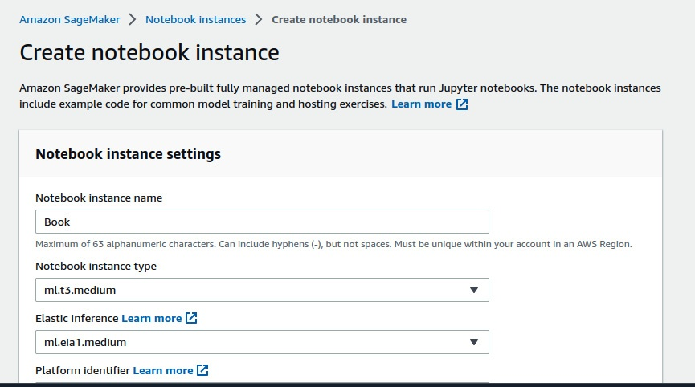
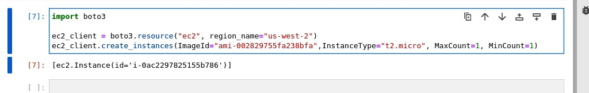
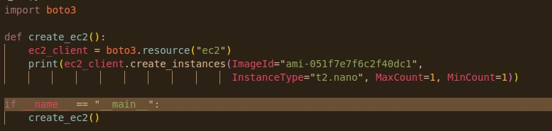
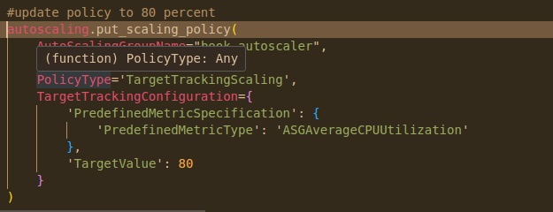
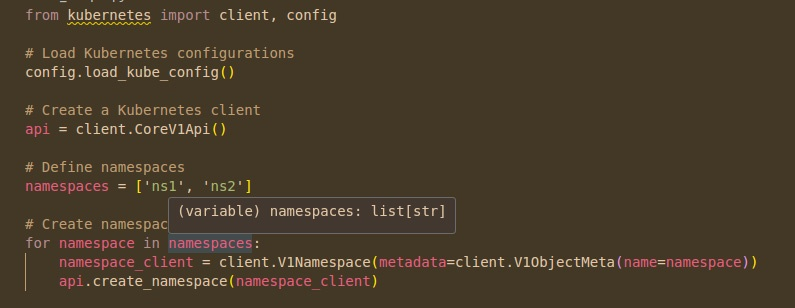

# Chapter 4 Provisioning Resources
**DevOps** is a game of resources. Of taking the resources that you have and putting them in the right place. It sounds easy, but it is not. The acquisition of resources is based on several criteria and requirements that the DevOps engineer receives. If you want to optimally provision resources, then you have to understand the logic and reasoning behind provisioning those resources as well as the strategy behind the intended use of the underlying infrastructure.

And if you want all that in plain English: take only what you need.

So, that will be one of the underlying concepts of this chapter: rightsizing. **Rightsizing** is the art of finding the optimal resource sizes for your application or workload. A lot of this is just trial and error (often yours, but someone else’s if you can get it) and trust me when I say this, it is much easier to do that programmatically than manually in the modern DevOps landscape.

But that’s easier said than done, because sometimes the load placed upon your resources is a lot larger than the size of the resources you’ve provisioned, especially if your application becomes popular. You become a victim of your own success. Or you provision resources that can hold at maximum capacity, but that capacity is only occasional, and you can’t possibly ramp your resources up in time.

This brings us to the second underlying concept of this chapter: scaling. **Scaling** your resources up and down is one of the important aspects of DevOps and removing resources is as key an aspect of provisioning them as adding resources is. This must almost always be done programmatically, and we will look at a couple of ways in which Python can help us with that.

If you master these concepts and how to use them effectively, you can save you and your organization a massive amount of time, money, and resources. In addition to this, you will be able to deliver on spikes in demand in a way that addresses the needs of both your organization and its customers.

In this chapter, we will explore the following:
* How to provision virtual resources with Python
* How to use Python SDKs for various clouds and provision resources through them
* How scaling works, the types of scaling, and choosing the correct type of scaling
* How containerization of resources can help with rightsizing and easier provisioning (and where Python plays a role)
## Technical requirements
Here is a list of requirements that you will need to meet to complete the exercises in this chapter:
* Python installation with boto3, Kubernetes, and Docker libraries installed
* An AWS account
* Knowledge of how to use a Jupyter Notebook
* If you are on Windows, the use of Windows Subsystem for Linux (WSL) to use Docker locally
* A GitHub account, and basic knowledge of Git and repositories
* A basic understanding of virtualization and Kubernetes

## Python SDKs (and why everyone uses them)
Let’s take it from the top. **SDKs**, or **software development kits**, are official programming libraries and **CLIs** released by a platform that allows developers to develop tools and applications that leverage that platform. These SDKs are usually written in very popular languages so as to cover the largest number of developers possible.

The three major clouds (where the majority of DevOps work is done) have the following programming languages in common among them for SDKs: **Java, .NET, C++, Go, JavaScript/TypeScript/Node.js**, and **Python**. If you work on one of these – and the chances that you do are greater than the chances that you don’t – you need to choose a programming language.

So, the question then becomes, why Python? Also, why are we asking this question four chapters into this book? Well, I’ll tell you. Python is the exact balance between loose and structured that is necessary to pull off a lot of DevOps principles.

Strictly typed languages such as Java, .NET, and C++ can be good for development, but they will produce awful results for the flexibility that is required of the modern DevOps workload. That being said, most clouds are built on these languages. But operating on them is a different game entirely. Think of these languages as the bones that provide sturdiness and Python as the joints that provide flexibility – they should be everywhere that requires flexibility.

Then, on the other end of the spectrum, you have that JavaScript trio. The reason they are sometimes unsuited for this – even though there is a massive amount of support for them from the major clouds – is the limitations and syntactic quirks that are natural to these languages. They aren’t meant to natively work this way and in addition to that, they are single-threaded and difficult to operate concurrently.

The primary competitor and, at times, cooperator to Python in this department is Go. And let me tell you, Go is good. A majority of cloud-based tools such as **Docker** and **Kubernetes** are built in Go, and ones that aren’t are usually built in Python. But Go is really the only other language that can go toe to toe with Python for how useful it is in DevOps. And I’m telling you this because much of what I’m going to work through in this chapter will involve frameworks written in Go, such as **Terraform** and Docker.

With all of this information out of the way, let’s finally put the focus back on Python. Python is easygoing. It has variable assignment without strict data types, which is incredibly useful for loosely coupled services, a very common architectural choice. It has a big community and is almost always the first SDK offered by modern infrastructure providers. As mentioned previously in this section, Python can essentially enter into a symbiotic relationship with any framework written in any language. If there is a popular framework or tool, its Pythonic version will likely be well-maintained and properly updated.

That was a quick look at the importance of and popularity of Python SDKs, now, we are now going to see an example of how Python SDKs can be used to provision resources.

### Creating an AWS EC2 instance with Python’s boto3 library
**Boto3** – it’s a name you’ve probably heard very often if you’ve worked with AWS and Python. It is the SDK that contains nearly every major AWS service that is currently available with Python.

For this example, we are going to use Boto3 in a script that will provision an EC2 instance in your AWS account. It sounds simple, but there are still a lot of steps that you need to follow to make it happen, so let’s get started. We will now begin by first logging into our AWS account and searching for the Sagemaker service. Let’s dive into it:
1. For this exercise, we need a clean environment where we can write Python code but also configure permissions in a terminal. To do this, in my AWS account, I’m going to create something else that we will use down the line: a **Sagemaker** notebook. A **Sagemaker** notebook is a Jupyter notebook service run on AWS servers:  
      
   If you look at the breadcrumb at the top, you can see that the path is **Amazon Sagemaker -> Notebook instances -> Create notebook instance**.
2. Any smaller notebook is good. We’re using ml.t3.medium for this exercise:   
      
   Once your notebook is up and running, click on **Open Jupyter** to get to your **Jupyter IDE**. Now, the instance itself will have some AWS permissions because it is an AWS creation, but not enough to provision an EC2 programmatically. It will, however, come pre-installed with boto3 and the AWS CLI.
   > #### Important note
   > If you don’t have them installed, install boto3 with pip and the AWS CLI through AWS’s official website (https://docs.aws.amazon.com/cli/latest/userguide/getting-started-install.html), which contains installers for all operating systems.
3. Now, let’s try and provision the EC2 with the pre-existing Sagemaker role that comes pre-assigned to Sagemaker:   
   

It worked. But, as you see here, the Sagemaker instance already came pre-configured with a role that had EC2 access.. If that had not been the case, you would have had to give the role some permissions or use the AWS CLI to attach a role profile to the instance. But it worked, and that is great. You can view your EC2 instance in your AWS console.

However, there are a few things to note here:
* You always need to define an **ImageID** (AWS has a public catalog). The one I’m using is AWS’s proprietary Linux version.
* You need to define the instance size and the maximum and minimum number of instances to create.

Now, that was simple and easy to understand, wasn’t it? Well, that’s good. Now we can move on to the concepts that make the provisioning of resources so necessary. Scaling and autoscaling are essential concepts in DevOps and they are both just a matter of provisioning resources.

## Scaling and autoscaling
**Scaling** is the act of increasing or decreasing the size of a workload or resource depending on the demand for it. **Autoscaling** is doing this automatically based on some sort of trigger.

As is often the case with workloads and applications, you can become a victim of your own success. The more your application succeeds, the greater the strain on it due to demand from users or services. To manage this strain often requires limitations placed on access to your application. You should do this if you don’t want to get overwhelmed with requests, trust me, because someone will try to do exactly that. But you should also have provisions in your infrastructure that can help it grow naturally with your growing user base.

That is where scaling comes in. Scaling can be done either vertically (adding greater computing power to a device) or horizontally (adding more computers). When performing one powerful act, vertical scaling is ideal and when processing a greater number of requests, you’ll need horizontal scaling. Most DevOps workloads require the latter over the former.

We will now explore the different types of scaling based on how hands-on you have to be with the workload that you are scaling. We will start with manual scaling and slowly escalate toward a more automated approach.

### Manual scaling with Python
Before we dive into autoscaling, let’s just look at some regular scaling (done with Python, of course). We will vertically scale an instance manually using Python’s SDK for AWS. I will be using just my regular local IDE. But you can do this with any combination of Python, AWS CLI, and an AWS account. So, let’s head into the steps you would need to take to manually scale an EC2 instance using Python scripts:
1. [Here is the code](./create_ec2.py) to create an EC2 instance (this will be up in the book’s repository as well):   
      
   And when you run it, you’ll get the instance ID (which you will need for this next part):   
       
   You’ll see that the instance with that same instance size and ID has been created on the AWS EC2 console:   
   
2. Now, vertical scaling acts on that same instance but the instance size cannot be changed while it is running, so we will [stop the instance first](./stop_ec2.py):
    ```python
    import boto3

    def stop_ec2():
        ec2_client = boto3.client("ec2")
        print(ec2_client.stop_instances(InstanceIds=["i-02d42ec52027baa08"]))

    if __name__ == "__main__":
        stop_ec2()
    ```
    This code will stop the instance when it is run. Confirm that the instance is stopped and note the size of the instance is still **t2.nano**:
    
3.  Now, let’s write [the code](./update_ec2.py) to modify the instance into a **t2.micro** instance:
    ```python
    import boto3

    def update_ec2():
        ec2_client = boto3.client("ec2")
        print(ec2_client.modify_instance_attribute(
            InstanceId="i-02d42ec52027baa08",
            InstanceType={
                'Value': 't2.micro',
            }
        ))

    if __name__ == "__main__":
        update_ec2()
    ```
    After running this code, you’ll notice that on the console, your instance is now a t2.micro instance:    
    
4.  So, once you restart the instance, it will have that extra power available.

You may have noticed that this is a slog. And vertical scaling is – more often than not – a slog of downtime. While there are use cases for things like these (especially when you need to work with bigger individual machines), it’s not the norm. Usually, horizontal autoscaling is better for your use case because of the lesser amount of downtime associated with the process. We’ll dive into that now.   

### Autoscaling with Python based on a trigger
Autoscaling requires automating the process of increasing the available compute resources according to some sort of metric or statistic. In order to autoscale, we need to design a mechanism that will trigger our SDK call once a certain metric or threshold has been reached.

Understand that looking at this particular example from a singular cloud perspective may make it seem a little impractical because most cloud platforms have in-built autoscaling. The key here lies in fine-tuning that autoscaling. I’m going to create an **autoscaling group** and define the thresholds for scaling using a Python script. Then, I’m going to modify those thresholds and I will tell you the significance of why after I have done it.

Let’s write a [basic script](./autoscale_create.py) to make an autoscaling group and put a threshold on it using a policy for CPU utilization. We’ll go step-by-step from the launch configuration to the autoscaling group to the rule by which the instances will autoscale:

1. First, we write the code to create a launch configuration that all machines in the autoscaling group will follow:    
   ```python
   #create a launch configuration for use in autoscaling
   autoscaling.create_launch_configuration(
         LaunchConfigurationName="book_configuration",
         ImageId="ami-051f7e7f6c2f40dc1",
         InstanceType="t2.micro",
   )
   ```
2.  Next, we create the autoscaling group, which uses the launch configuration that we created previously:   
    ```python
     #create an autoscaling group with your launch configuration
     autoscaling.create_auto_scaling_group(
     AutoScalingGroupName="book_autoscaler",
         LaunchConfigurationName="book_configuration",
         MinSize=2,
         MaxSize=5,
         DesiredCapacity=2,
         AvailabilityZones=['us-east-1a', 'us-east-1b'],
     )
    ```
3.  Finally, we will create a policy that will scale the group upward if CPU utilization is greater than 70%:
    ```python
     #create a policy for your autoscaling group
     autoscaling.put_scaling_policy(
         AutoScalingGroupName="book_autoscaler",
         PolicyName="book_scale",
         PolicyType='TargetTrackingScaling',
         TargetTrackingConfiguration={
             'PredefinedMetricSpecification': {
                 'PredefinedMetricType': 'ASGAverageCPUUtilization'
             },
             'TargetValue': 70
         }
     )
     ```

Running all of these will give you a basic autoscaling group of virtual machines with these specifications. Now, you may be asking yourself where Python helps with this autoscaling. Well, for that, you first have to look at the metrics produced by these virtual machines.

If you look through the metrics that are produced by the VMs, you’ll be able to find their CPU utilization metrics, which can be exported. Using these metrics, you can calculate the average utilization of CPUs over a period of time (that programming language Python helps, I’m told), then use that data to find a better autoscaling target. To modify the target, you can simply use the same code as before with a different metric value:   


Your findings on the data may even reveal that there is a better metric to use for your workload than CPU utilization. You can modify that here as well.

This type of scaling is very useful and there are a lot of situations where you definitely will use these. However, this isn’t the only way to implement scaling and virtualization. In the next section, we will explore containers and their roles and purpose in the field of scaling and virtualization.

## Containers and where Python fits in with containers
**Containers** are small packages of software that serve as a unique runtime containing all of the necessary resources to run a small facet of an application, or sometimes the entire application itself.

The containers themselves are written in Go, as is the container orchestration service, Kubernetes. Those parts do not require Python unless the application code itself is written in Python. Where Python comes in handy is as the glue between the various containerized services. Orchestrating the orchestration, if you will.

Now, we are going to learn about the role that Python plays in the overall container picture. Python, as always, has a lot of libraries that support the use of containers and Kubernetes, and we will explore some of these libraries and how using Python can simplify your DevOps work where these important infrastructural elements are concerned.

### Simplifying Docker administration with Python
Keeping Docker images together and organized is tricky. It’s why they invented Kubernetes. But Kubernetes itself is tricky. This leaves two gaps:
* First, when there are multiple Docker images but complete orchestration with Kubernetes is not required
* Second, when Kubernetes APIs need to be frequently called or the cluster needs to be frequently updated
For both of these purposes, Python can be a useful tool. Remember this is about support, not refactoring. We’re the auxiliary player here.

So, in this section, we will look at an example of how to use Python to administer multiple containers.

We will write [a script to get a specific Docker image and create a container for it](./docker_sample.py). This script can be rerun to do the same thing over and over again. You may also use the **restart** command if a container malfunctions. Now let’s look at the code to pull Docker images and start a container:
```python
import docker

def docker_sample():
    client = docker.from_env()

    # Define the image name and tag
    image_name = 'python:latest'

    # Pull the image
    client.images.pull(image_name)

    # Create and run a container based on the pulled image
    container = client.containers.create(image_name)
    container.start()
    print(client.containers.list())

if __name__ == "__main__":
    docker_sample()
```
It’s simple, but that’s the key to it. Its simplicity provides building blocks to improve upon.

But even if we keep it simple, sometimes the use of containers gets complex, which is where Kubernetes comes in. With Kubernetes comes its own challenges. These challenges can also be simplified and managed using Python.

### Managing Kubernetes with Python
There will come a time in your container usage when Kubernetes will be the way that you need to go. At this time, Python can help as well. Python can help simplify a lot of Kubernetes administration tasks and since most Kubernetes workloads are run on the cloud, those SDKs are going to come in pretty handy as well.

I’m only going to include one example, which will consist of the manipulation of Kubernetes namespaces. Just to be safe, we don’t want to crash and burn with computing resources yet, especially if you are new to Kubernetes.

**Namespaces** are abstractions within a Kubernetes cluster that are used to divide computer resources based on certain criteria. A criterion can be environment (dev, production, etc.), network restrictions, or based on resource quotas available to a namespace.

You can use Python to create and modify namespaces and manipulate the resources within them. Let’s look at the steps to initialize a Kubernetes cluster and manage it using Python:

1. First, you will need to install Kubernetes with **pip** using the following command:
``pip install kubernetes``
2. Next, let’s write a script to create a few namespaces in our cluster. We can add resources to these namespaces later:  
   
3. Now, let’s write a policy for these namespaces and implement them into Kubernetes:
   ```python
    for namespace in namespaces:
        namespace_client = client.V1Namespace(metadata=client.V1ObjectMeta(name=namespace))
        api.create_namespace(namespace_client)

    # Create a Kubernetes networking V1 API client
    networking_api = client.NetworkingV1Api()

    for namespace in namespaces:
        # Define the Network Policy manifest
        network_policy_manifest = {
            "apiVersion": "networking.k8s.io/v1",
            "kind": "NetworkPolicy",
            "metadata": {
                "name": "block-external-traffic",
                "namespace": namespace
            },
            "spec": {
                "podSelector": {},
                "policyTypes": ["Ingress"]
            }
        }

        # Create the Network Policy
        networking_api.create_namespaced_network_policy(namespace=namespace, 
                                                        body=network_policy_manifest)

   ```

This will create policies for both namespaces, which will block external traffic from outside the namespace. As you can see here, we’ve implemented the same formatted policy to both namespaces using an iterator. This is but one of the ways you can automate in Kubernetes using Python.

Eventually, you can automate these steps to the point where it will be possible for you to simply list out and visualize your Kubernetes cluster and press a couple of buttons to adjust it to your needs. Everything else, the cluster will take care of.

## Summary
This chapter sent us on quite a trip in terms of how we use Python. We figured out how SDKs work, what advantages they have, and why Python is so useful to have in the world of SDK use. You can literally build applications on top of applications, I’ve seen it.

We also learned about scaling and how much of a hassle that is because of the balance you have to strike between availability and cost. Here, we also found use for Python and its great SDKs and data processing abilities, helping us strike that balance.

Containers are also greatly supported by Python libraries, which can help act as a glue filler in the gaps between Docker and Kubernetes. We learned about the assisting role that Python plays in the management of these services.

So, in conclusion, in this chapter you have learned quite a bit about Python’s SDKs, using them for autoscaling, rightsizing, and containers. In the next chapter, we will take a closer look at how Python can be used to manipulate and interact with already provisioned resources.