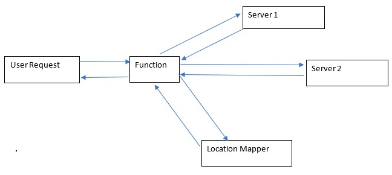

# Chapter 5 Manipulating Resources
In the previous chapter, we talked about creating resources. We talked about using automation to provision the correct specifications of resources every single time. But what about pre-existing resources?

In some real-world scenarios, you may be expected to work with projects or workloads that you haven’t created from scratch, or that need to be touched with a very fine hand. You may also be working with resources that you have a lot less power over, such as managed resources in your cloud that are managed by your cloud provider.

It’s easy to manipulate the resources that you have made, but these legacy resources and resources that have fewer controls are the challenge for DevOps engineers. Conquering these challenges requires learning how to manipulate resources to make them more inclined to the DevOps philosophy. Whether that involves a change in approach in the resources, the code, the architecting process, or just understanding the workload better, we can use the philosophy of DevOps to make resources better provisioned and better performing.

Speaking of performance, one of the best indicators of how future performance should look is past performance. If the usage of resources can give us a pattern, we can use this pattern to predict the provisioning of resources better and streamline our workload. Besides that, any insight that we gain regarding not just usage patterns but how the DevOps team and the application team handle the resources and react to events is useful for future reference.

Being predictive in the approaches that you take can be very useful, but these predictions must always be made on the back of solid data. If we are to predict and adapt, it must be done according to some sort of logic. This logic must be understood (there are people in this world who do things just because they’re told how to do it one way; they’re useful but they cannot adapt) fully to allow for effective action to be taken.

The primary goal of this chapter is to help you learn how to look at the resources you have and to use them to maximum effect. This means understanding how the resources scale up and down, as well as the history and historical components of those resources.

With that, in this chapter, we will cover the following topics:
* Modifying resources to adjust to demand using Python as a trigger for events
* Analyzing live and historical data and using it for future workloads
* Refactoring a legacy application slowly over time
## Technical requirements
To complete this chapter, you will require the following:
* A GitHub account
* Python
* An AWS account
## Event-based resource adjustment
Resources are money. Literally. In the world of DevOps, the norm is that the more resources you use, the more money that you spend. That’s simple enough, right? But the problem comes when the return from those resources is not enough to cover their costs. One of the main reasons this happens is because the resources that are consumed are done so at a constant rate, even if they are not required. For optimal resource consumption, a new method was created one with which resources are only consumed at the time of their use and are then downsized appropriately until their next use. Let’s say that you are on a shopping spree. You don’t know exactly how much you’re going to spend, you have only a vague idea of how much you are going to spend on the items. You are probably going to go over the tentative budget that you have set for yourself and in addition to that, you might not even be happy with everything that you bought.

DevOps is a lot like that – it is about the groceries (resources), how much you spend on them, and how much value you can get out of them. One of the most common ways to keep track of a grocery/expenses budget is to make a nice spreadsheet where you can tally up everything. Here, again, there are similarities to DevOps, though in DevOps, you are usually given an exact quote by your resource provider and it’s easier to find better deals than with groceries – trust me.

Now, for the final part of the grocery section, you adjust the groceries you buy according to the events that you have, right? If your friend’s vegan, you cook vegan stuff. If they have diabetes, sugar is off the menu. If you’re by yourself, you can buy a tub of ice cream with no judgment. That’s exactly what we want with our event-based adjustments. You can use the type of event that is being brought to you to adjust the resources being provided. You can look at the events that are going on and adapt your resources accordingly.

We are going to show this concept while considering a couple of examples – one that deals with the global distribution of localized content and another that deals with testing a new feature for a website on a small subset of users.

### Edge location-based resource sharing
One of the most difficult challenges that we have with a global application is load time for resources. If a user is too far from the closest data center, it can result in a significant amount of lag and latency when they use their application. For this reason, most companies with applications on a major scale have data centers and edge caches in high-population areas/areas with high web traffic. An **edge** or **edge location** is just a data center that is closer to the target user, making their load time faster. **Edge caches** are user and website data (such as cookies) stored in edge locations for faster access for that user. This helps users get to data centers that can serve them the fastest.

However, the question now becomes, how do we direct these users to the appropriate data centers or caches that will give them the lowest latency? To do that, we must find a way to acquire the location data for the user’s device and reference that data to redirect that user to the closest data center.

To do this, we can write a function that takes a web traffic request and extracts certain headers from it. Let’s look at [the code](./edge_testing.py) for this:
```python
''' the request variable is a json that contains the request headers 
and body'''
def process_request(request):
	'''get all headers'''
	headers = request["headers"]
	''' we're using country in this example, but this is any arbitrary 
	header you choose to pass '''
	request_country = headers["country"]
	''' throw to a function that maps each available server to a country 
	'''
	server = server_map(request_country)
	''' return value from correct server as prescribed by server map '''
	return server_response(server, request)
```

What this code does is pick out the country header, which you will need to define yourself (which is good, because you can customize it), and then direct the web request to the appropriate server. A small layer in between the request and response can work wonders for connectivity. You can see an illustration of this in the subsequent figure:    
  
Now that we have learned how to redirect users to custom locations, let’s look at how to redirect features toward a custom set of users.

### Testing features on a subset of users
When an application needs to implement a new feature and the application team wants that feature to be tested in a live environment, the need arises for some sort of mechanism that sorts a small subset of users into a group that will receive that new feature. The analytical data acquired from this group will then be used to judge the feature and its effectiveness based on certain criteria. The reverse – removal of a feature – works this way as well. If you recall when YouTube removed the numbers from their dislike button, some users still had their numbers for weeks because of their cached website versions. Even after that, browser extensions came out that extracted the dislike number from the YouTube API itself for whichever video you were watching (that is, until YouTube took it out of their API entirely).

Now, you may be wondering why such a test would be necessary given the fact that the feature had probably been tested over and over again, even before it had been launched. Well, here’s the thing:

* **It might not have been**: You’ll be surprised how many companies are willing to put a new thing out there for a small subset to use without going through user acceptance testing. You’ll be even more surprised to learn that this isn’t a bad strategy sometimes (but if you are going to do this, I suggest you do it with the example I’m going to give you in the upcoming code block).
* **Users break stuff**: It is the nature of users to break stuff in ways that testers cannot comprehend. You cannot fully understand human nature and the chaos behind it and any invention you make must be tested against it. Having a more controlled approach requires throwing your work to a subsample of chaos and hoping that it can endure.

This method of testing is commonly referred to as the **A/B testing method**.

Now that that’s out of the way, we can get to the implementation. This implementation is very similar to that of the implementation for the edge locations and involves a proxy very much in that vein.

We’re going to subset our users in two ways: randomly and based on some criteria. First, let’s look at the code for the random distribution of user requests (20% to one server and 80% to the other server):
```python
''' get request from user '''
def process_request(request):
	''' get a random number between 1 and 10 '''
	num = random.randrange(1,10)
	''' conditionally return site containing special feature '''
	if num<=2:
		return special_response(request)
	else:
		return regular_response(request)
```
You can choose a less arbitrary range if you’d like. Just remember to track the statistics between these two responses differently to get the correct insights. An alternative to this is **feature flags**, but that requires dividing users into subsets based on certain criteria, which is what we are about to cover in the following code block. The preceding method is good if you don’t want to distinguish between users or can’t and just want activity data:
```python
''' get request from user '''
def process_request(request):
	'''get request header with feature flag '''
	header = request["header"]
	feature = header["feature"]
	''' Check if feature flag is turned on, i.e. if it is True or False 
	'''
	if feature:
		return featured_response(request)
	else:
		return normal_response(request)
```
Here, we can see the users who have feature flags getting the featured response (the unique response they get if their feature flag is on). These featured responses are different from the regular responses. The activation of the feature flag can be a random edit made to the database or an opt-in offer given to the user. Once again, the data for these two resources needs to be distinguished for maximum effectiveness.

Speaking of data (and I have been), now that we have all of this analytical and operational data from people using the feature flags and those who are not, as well as the occurrence of all of these events, we must do something with it – we need to analyze it and generate insights.

## Analyzing data
I have found that – as an adult – I have increasingly become more and more responsible for myself. However, this responsibility and the person that I am right now have come from a series of events in my past. Mistakes, successes, and everything in between have defined me and my approach to life.

A lot of my approaches to life also happen to be approaches to DevOps – that’s just how that panned out. Through the life (and DevOps) lessons that I have learned, I’ve found two things: you must live for the person you are right now, and that person is defined by your past and yet is not the same person as in the past.

Your workload follows a similar pattern. It is based on your history but cannot completely be considered the same as it was previously. The code has probably changed, the infrastructure is different, and even the personnel that implement it most likely have changed. However, with all that being said, there are still lessons to be learned from the past. Important lessons.

Earlier in this book (Chapter 1, Introducing DevOps Principles, to be exact), I emphasized the need for **monitoring** and **logging**, and I said that these were great tools for event handling and maintaining the historical performance of your workload. Now, we will begin exploring how that historical performance can give us insights that we can use to our advantage.

We will look at a couple of analysis techniques: analysis of **live data** and analysis of **historical data**. Each presents challenges. Each can act as a template to solve a fairly common DevOps problem.

### Analysis of live data
Live or streaming data is data that is constantly being processed by a system at present. It is data that’s being received or returned by a system. A system lives off of the data that it absorbs and generates (*input -> process -> output*). The system is shaped by this data and sometimes, in the case of critical systems, it needs to be molded by this data. To make tactical decisions based on recent data, collecting live data and immediate insights on that data is necessary.

Most clouds and monitoring systems come with default ways to store and analyze live data. And for the most part, they are quite effective. They can store data and generate insights on that data to a certain extent. However, sometimes, a custom approach is necessary. And this is where Python excels. Not because of speed, but because of convenience and a pre-built library for analysis, Python (even with only its default libraries) can perform data analysis and conversion on practically any kind of data that a system gives out.

So, let’s look at an example where we use Python’s built-in **marshal library** to decode a **byte string**:
```python
import marshal
''' function to decode bytes '''
def decode_bytes(data):
	''' Load binary data into readable data with marshal '''
	result = marshal.loads(data)
	''' Return raw data '''
	return result
```
Byte strings are often used in **network communication** and **cryptography** (both of which usually involve live data), and converting them into other languages may require adding libraries and possibly creating custom data types. There’s no such need with Python.

But this usually accounts for smaller sizes of data and recent data, sometimes as recent as the last millisecond. For a truly historic analysis, you need millions of rows of data. You also need something that can analyze that data. Here, Python excels even more.

### Analysis of historical data
Live data can help us make adjustments; they are tactical. But to be truly strategic – to think about the big picture and to think long term – you need historical data and a way to analyze it. The past contains a lot of data; this data contains patterns, and it is in these patterns that the key to optimizing your workload lies.

The analysis of historical data requires converting the data into a format where it can be mass-read by a program. Once this data has been formatted, it can be fed into an algorithm that processes the data into useful information that the data engineer may want.

Dealing with historical data usually means dealing with data that is consistent and high in volume. However, one of the potential variables can be whether the data is uniform or not. Oftentimes, when the software to record data is changed or upgraded, certain aspects of the data change as well. Reconciling the old and the new historical data is one of the challenges that DevOps engineers working with data can face.

The next challenge that the engineers potentially face is the ability to present the data in a format that either humans or machines can read. For humans, this would be some sort of document or visualization. For machines, this would be some data format that they can read.

Regardless, all of this data requires mass data analysis. You can achieve this even faster by using Python’s **multiprocessing library** to batch-process a large amount of data in parallel by leveraging multiple CPU cores for this purpose. Let’s dive into the process of using multiple CPU cores with code:
```python
import multiprocessing
''' Get list and return sum '''
def get_sum(numerical_array):
	''' return sum of array '''
	return sum(numerical_array)
	'''method that calls sum method to get total sum for 1 million records 
	'''
def get_total_sum(full_array):
	''' Initialize 4 processors '''
	pool = multiprocessing.Pool(processes=4)
	''' List of sums in 10,000 number blocks '''
	sum_list = []
	''' Get 10,000 values at a time for sum out of 1,000,000 '''
	for i in range(0, count(full_array)/10000):
		sum_array = full_array[i*10000:(i+1)*10000]
		'''Make an array of 10,000 length arrays '''
		sum_list.append(sum_array)
	''' Get final array of sums of each 10,000 value array '''
	final_array_list = pool.map(get_sum, sum_list)
	''' Get one final sum of all these elements '''
	return sum(final_array_list)
```
So, in this code, an array of 1 million values is divided into 100 arrays of 10,000 values, each of which is summed up to calculate the total for their array. This is done on one of four different processors at the same time using the multiprocessing library. Breaking down this large task into smaller tasks can optimally use resources for data processing.

Well, all of this is nice enough. But where does the data come from? Usually, your applications. Well, for the data to be good, the application has to be good, right? Yes, but that is not always the case. Let’s look at what happens when some applications remain stagnant and become stale.
## Refactoring legacy applications
A clean slate is one of the most convenient things in the world. I am going to show you two sheets of paper, and you can tell me which one you’d want to draw on:   


If you chose the right one, congratulations – you are now a DevOps engineer! Don’t look too deeply into this particular drawing; it’s just some rubbish I put together.

You see, DevOps engineers rarely get to work with their code. Even developers getting to work with their code is getting rarer these days. In my experience, I have only worked with a clean slate on a project in any non-personal capacity once or twice. Many of you who are just starting may have only worked with either projects you coded yourself or little template projects you may have found. However, in a real-life scenario, that is quite rare.

Even if you work with a blank slate, unless you have built assembly code with your own customized operating system, there are still a lot of dependencies that your workload relies on (and if you are doing it this way, how bored are you?).

99% of what you work with is built with something somebody else worked on – sometimes, hundreds and thousands of somebodies with varying levels of skill, competencies, and opinions. You walk a path built by a multitude of architects (and sometimes with no roadmaps/documentation).

You see, initially, it’s simple – you start with the latest version of the code, you host it on **localhost**, and voila, you are the master of your world. But then, you realize that everyone did this and everyone is desperate to hold onto that sense of control, even in a professional environment, regardless of the consequences upon the quality of their work. That is how you end up with critical infrastructure that hasn’t been updated in 5 years, critical services that run on discontinued products, and a team that is unwilling and unable (not either, both) to change it for the better. That is how you end up with tech debt (technical slang for horrible planning skills).

To get out of technical debt, you have three options: optimize, refactor, or restart. What that means is you have three choices (not just in DevOps, but in life too): live with your mistakes, improve upon them, or start fresh. What you want to do (and what you can do) depends on both you and your circumstances. We will look at all three of these options so that you can figure out which one is best for your workload.
### Optimize
Your first option is **optimization**. You can look at what you have right now and make sure that it runs optimally, consuming the optimum amount of resources while being available to the user with all of its functions intact. A lot of the time (especially in **Site Reliability Engineering (SRE)**, a field where you work in practically nothing but legacy applications) optimizing your legacy application might be your only option if you’re working with a critical application that cannot change one aspect without having to change many others – a monolith, if you will. These limitations are why a lot of companies look to break out of the monolith.

In the case of optimizing legacy applications, we are very limited in what we can do. But that doesn’t mean we can’t do anything. One of the most important DevOps concepts is **Desired State Configuration (DSC)** and the reason for that is maintaining systems such as these.

In a DSC, the virtual machine is given certain configurations that it must maintain. The state of these configurations is checked from time to time. If the state has changed significantly, then it is reset and brought back to the original desired state.

This all happens behind the scenes and doesn’t truly affect the application. It is probably the best way to handle an application that cannot be refactored or containerized into Docker containers.

### Refactor
If you’re working with anything resembling decent code or resembling a decent project team (big ifs, but bear with me), then you may only be working with a workload that is either outdated and needs an update plus adjustments or one that no longer fulfills all that is required of it. In these cases, there is a healthy middle ground between the old and the new in **refactoring**.

Refactoring your code base could involve simple things such as upgrading a dependency, writing a new component, or removing unnecessary components. It could also involve a long and arduous process such as separating a website’s frontend and backend.

So, let’s look at the most prominent method of refactoring that there is: the strangler fig. In nature, a strangler fig is a plant that uses a tree as a base to grow and eventually strangles the tree to death and replaces it. The strangler fig works similarly for legacy applications.

Here are the steps to perform strangler fig refactoring:
1. **Separate the database**: If the database server hasn’t been separated from the application server, do so now. This will help the scalability of both.
2. **Turn third-party API calls into functions/microservices**: If any third-party APIs are being called that you do not directly maintain, separate them into function calls that can later be called by your refactored application. Separate them from the rest of the backend.
3. **Separate the backend and frontend**: Separate the backend parts that deal with the data and the frontend parts that deal with user interaction. These parts need to communicate with each other using a buffer known as a frontend for backend, which is a middleman for API interactions with the frontend.
4. **Separate non-critical backend functions into microservices**: Separate the services that only process data and do not interact with the database into smaller microservices that can then process data independently and with greater scale.
5. **Create a database connection mechanism and put the rest of the backend into microservices**: Finally, the heart of the application becomes loosely coupled thanks to database connection strings, which allow the data to be manipulated from anywhere given the correct credentials.

That sounds a bit tricky, doesn’t it? Well, it is. But it’s also rewarding… sometimes. Refactoring an application – regardless of effectiveness – is one of the most effective ways you can practically learn about making an application and maintaining it. But it is quite a drain on the mind. Don’t you wish you could just get away from all of these mistakes other people before you made and start with a clean slate? Well, if you do, then the next section will fit in great with your plans.

### Restart
Sometimes – and I hope for your sake that that time is early in the development process – you need to throw the things you have out entirely and start fresh. A blank slate, as I have stated before, is the easiest starting point. If you believe that your application is beyond saving and that no insight or use can be salvaged from it, then you can build your application from scratch.

A lot of the time, it doesn’t make sense to migrate components between old and new applications either because of stack incompatibility or because the old components offer nothing of value. In these cases, the most valuable thing is the data generated by the old application and migrating that data to a database that can interact with the new application.

If you’re making a new application, honestly, do it your way. But here’s some advice:
* Make decisions that are long term and not just based on what you’re thinking about now.
* Make decisions that put quality first, but also understand that mistakes will always be there.
* Don’t react to everything; being reactive will 100% result in a worse application. If you can help it, don’t react to anything. Be proactive.
* Put quality, readability, and maintainability first. Don’t think that you’ll come back to something later. That kind of thinking adds many hours of work on your shoulders (or even worse, somebody else’s) later.

Restarting an application and building it from scratch is an appealing concept. Don’t restart too much, though, because you’ll never get anything done. There are only so many times you can restart a project before you realize that maybe your approach is the problem.

## Summary
This chapter took a few detours that you may have not seen coming. It was a chapter about simplicity, finding better ways to get your work done, and optimizing the use of your resources to get that work done.

You learned how to deliver content to your users faster and in a more customized way while at the same time collecting their data for analytical insights. You also learned the methods and formats of this data collection process, as well as the important role that Python can play in processing this data.

You also learned about applications, how most application waste is created, and how this can bog down your workload and your successors for years to come. You also learned a few ways to either mitigate, get around, or eliminate this problem.

So, in conclusion, you have now figured out that manipulating resources is about being efficient not just for the resources, but for the sake of your own time. I hope that you reflect on this chapter for your DevOps workloads and your grocery shopping.

In the next chapter, we are going to cover a particularly favorite topic of mine: automation. We are going to find ways we can make our lives easier and less bothered by things we shouldn’t be bothered with.